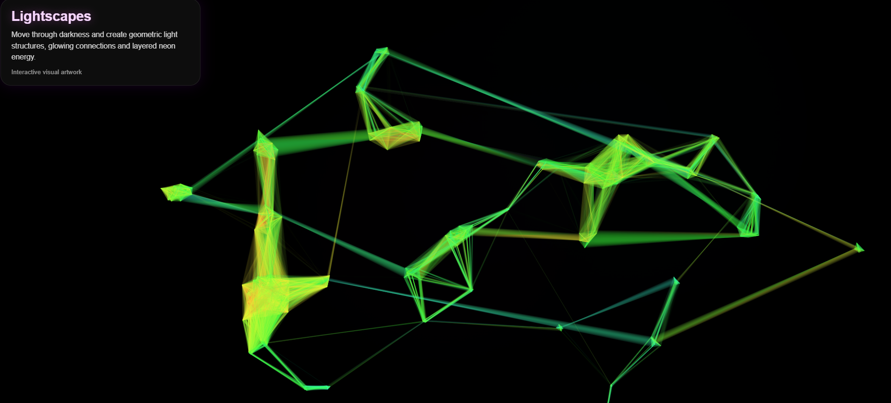
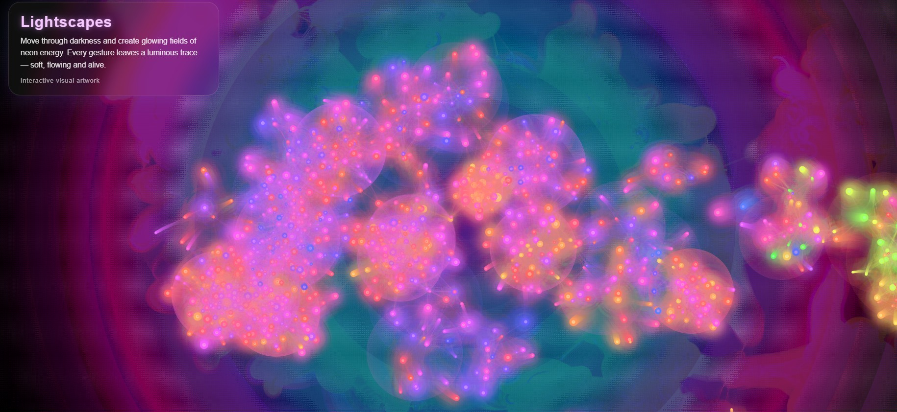
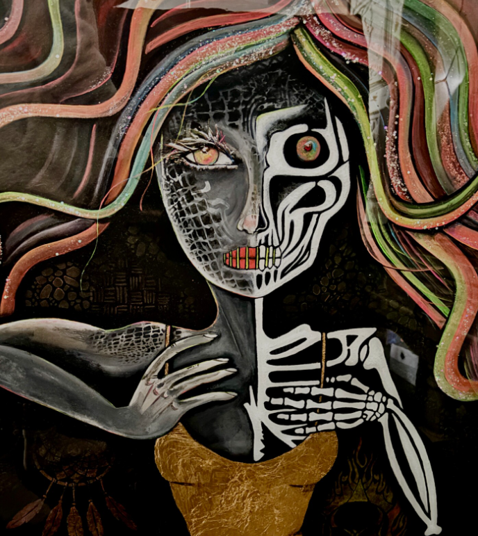

  

# ✶ Lightscapes – Neon Energy Generator

⟡ A digital space where light, movement and energy become visible.

---

## ❂ Concept

Lightscapes is not just a visual experiment.  
It is an exploration of energy, intuition and presence.

Every movement leaves a trace.  
Every interaction becomes light.

The project transforms simple motion into glowing neon particles and flowing energy fields – creating a living artwork that changes with every moment.

---

## ✶ Experience

Move your mouse or touch the screen and create:

✧ luminous neon trails  
✧ soft flowing light  
✧ dynamic energy patterns  
✧ a unique, unrepeatable visual moment  

Nothing is static.  
Everything is in motion.

## ✧ Visual Impressions

  

  
  

---

## ☽ Artistic Direction

Inspired by:

⟡ ultraviolet and neon aesthetics  
⟡ aura colors and emotional frequency  
⟡ spiritual geometry and inner balance  
⟡ darkness as a space for light to emerge  

---

## ✧ Live Artwork

⟡ https://designlili.github.io/lightscapes-neon-energy/

---

## ❂ Vision

Lightscapes is part of a larger creative journey.

A vision to combine:
art ✶ healing ✶ digital expression

into immersive experiences that connect inner worlds with visual reality.

It is an invitation  
to explore  
to feel  
to create  

---

## ⟡ Created by

Lili Kárándi  
Artist | Lightscapes Creator
